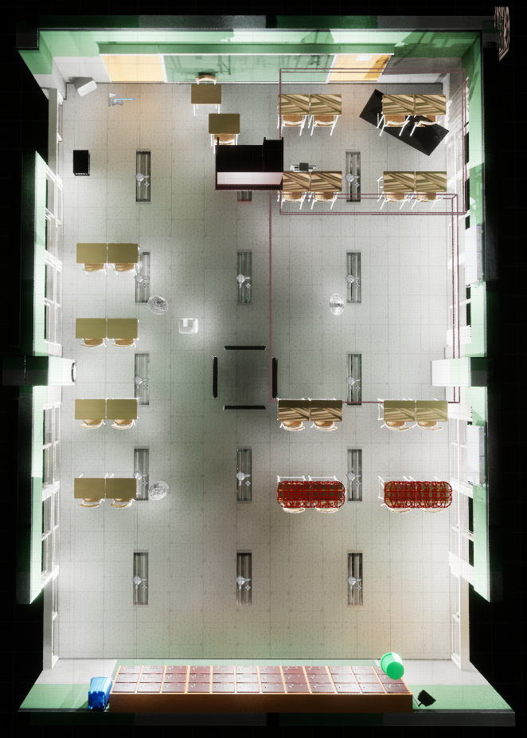

## 언리얼 프로젝트는 구글 드라이브에 있습니다.

# 🗺️ 미니맵 기능

## 📸 맵 스크린샷 예시

|            맵1             |             맵2             |             맵3             |
| :------------------------: | :-------------------------: | :-------------------------: |
|  |  |  |

---

## ⚙️ 설정 방법 스크린샷

**미니맵 설정 예시**

- 미니맵 크기, 시작 위치 등을 블루프린트에서 설정 가능

---

## 🎮 미니맵 인게임 사용 예시

- 플레이어 중심으로 지정된 영역만 미니맵에 표시되고 나머지는 잘려 나옴
- 실제 게임 화면에서는 미니맵 바깥 내용이 노출되지 않음
- 플레이어가 보는 방향에 맞게 화살표가 회전함

---
